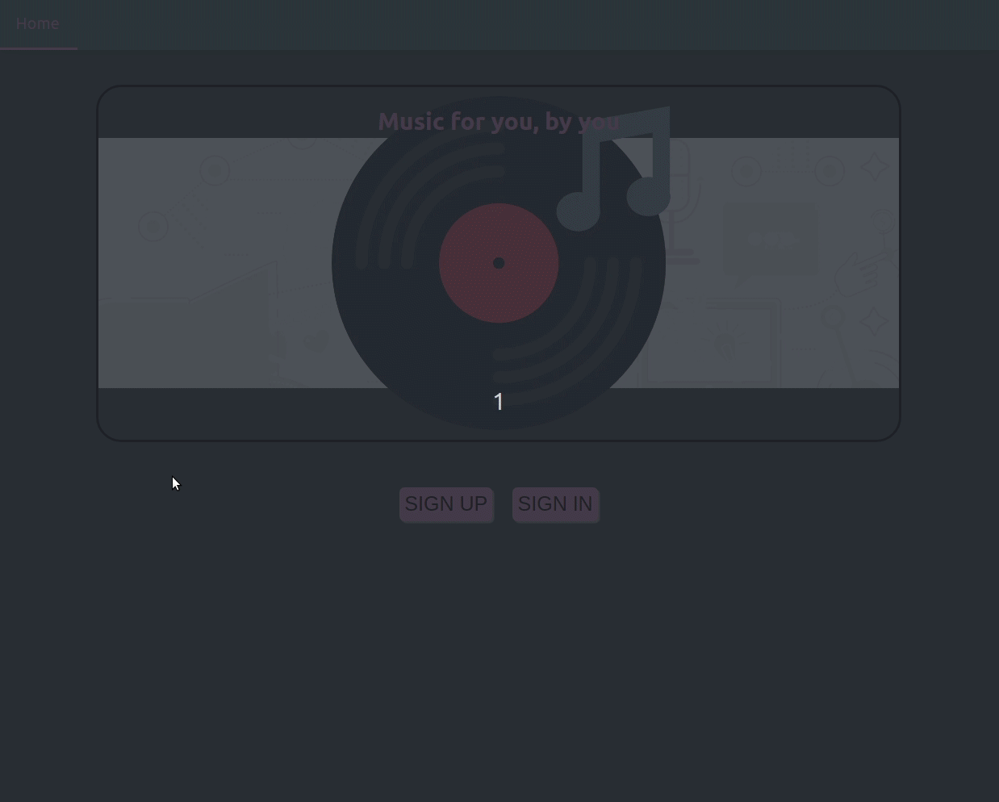
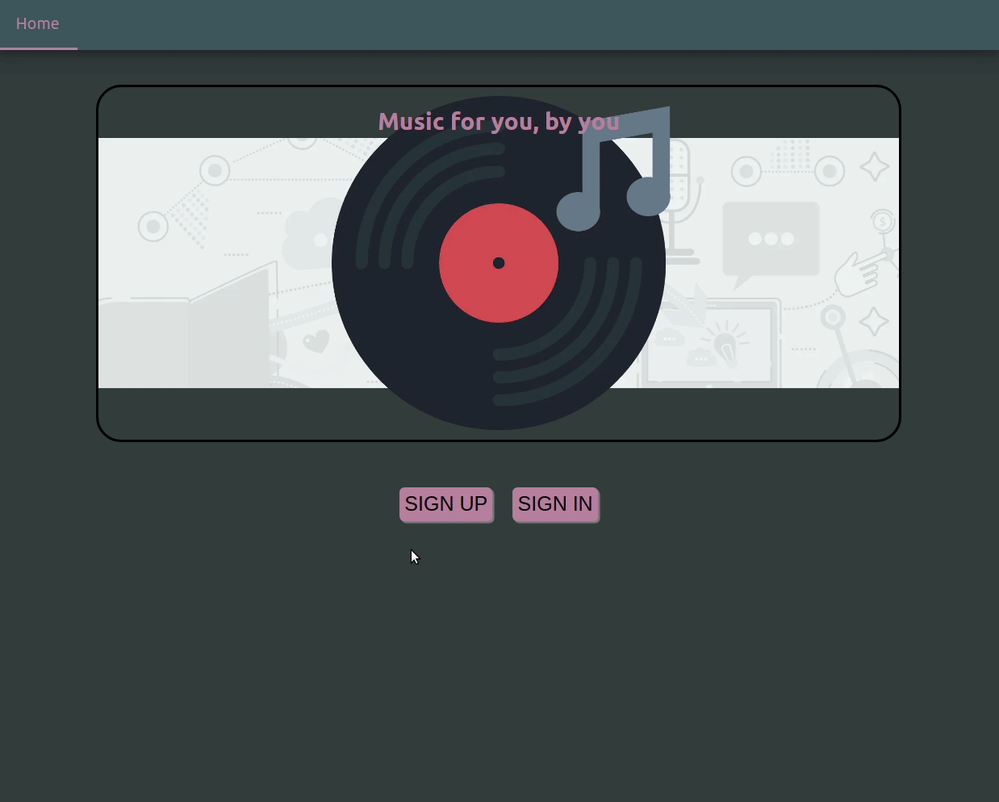
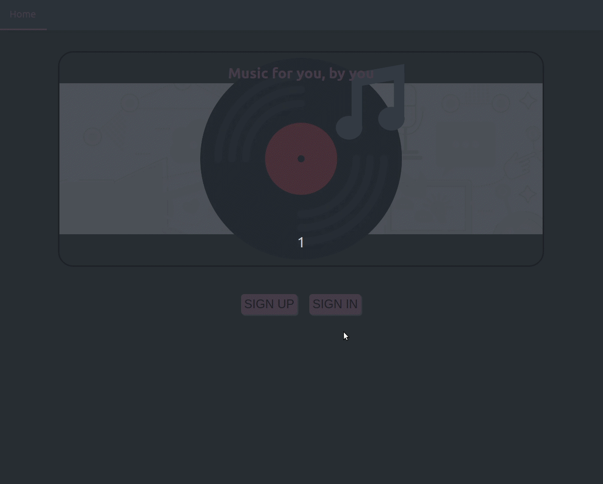
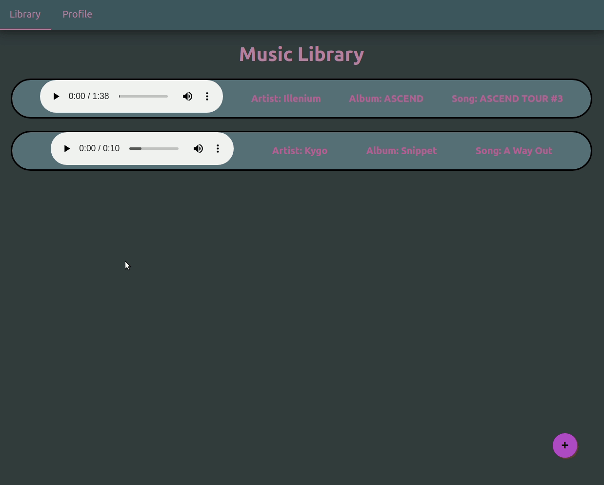
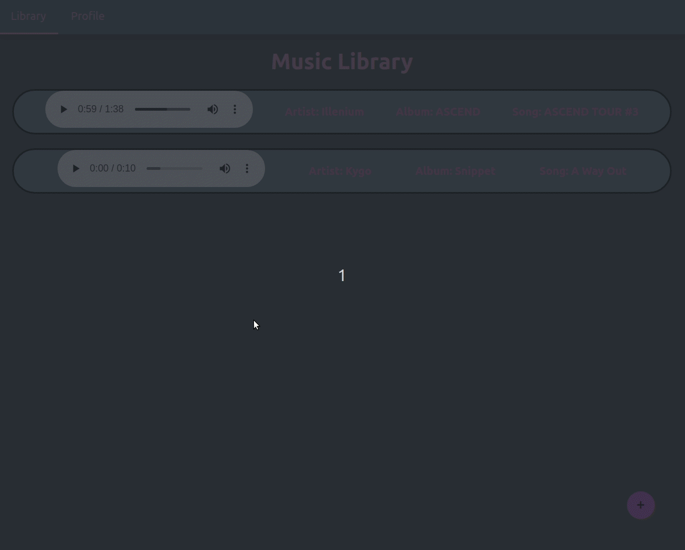
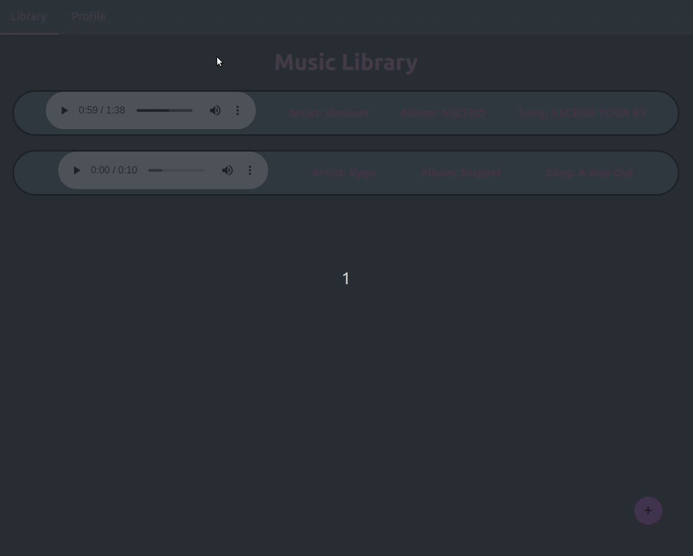
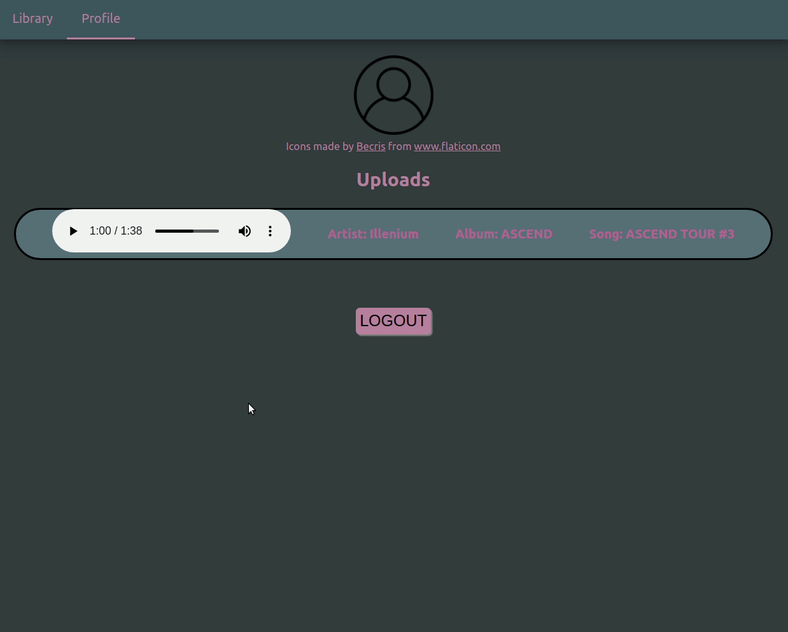

# Music App
Add music to Firebase RealTime DataBase/Storage and access it to listen to later. 

# Features

### Authentication ###

### Authentication Error Handling ###

### Authentication Sign In ###

### Music Player ###

### Add Music ###

### Profile Page with Music added by the user logged in ###

### Logout ###

